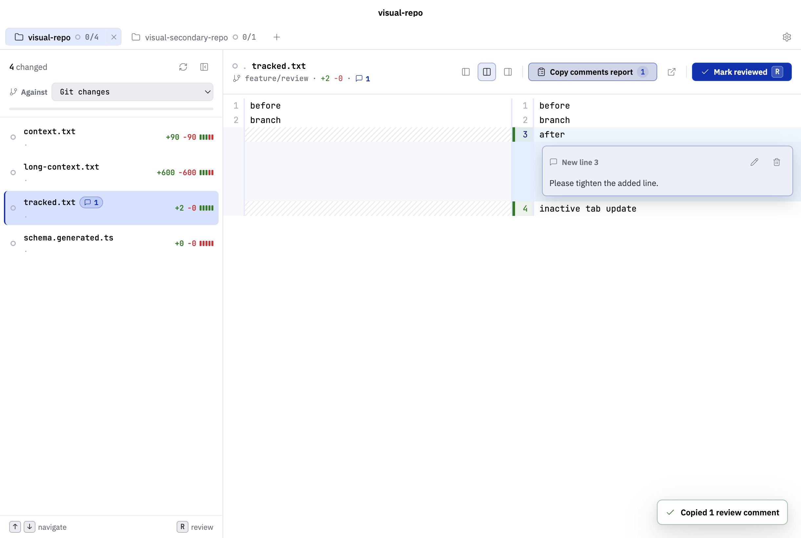
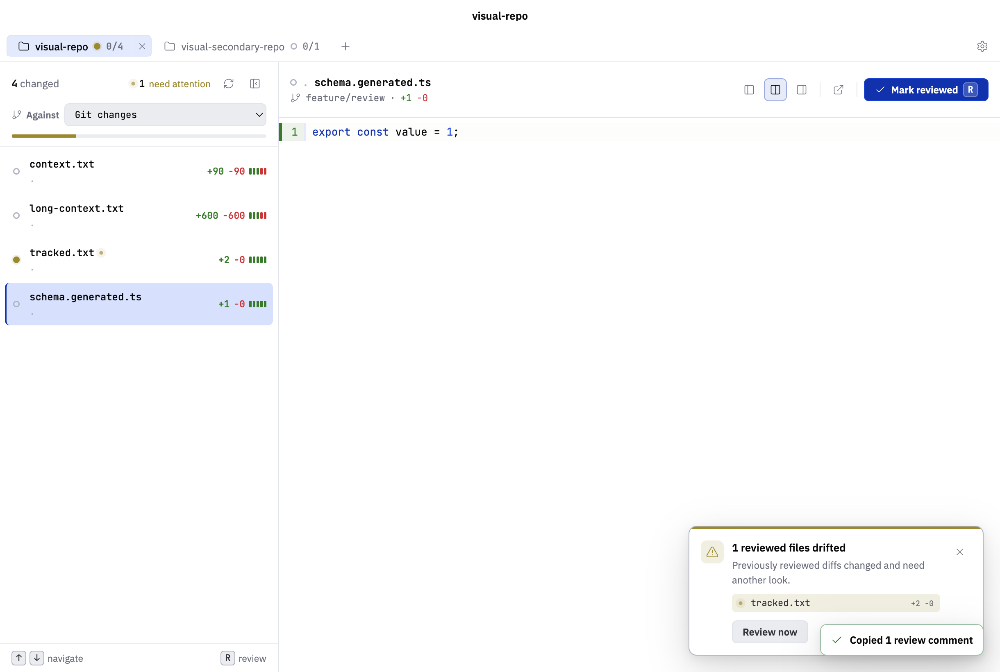
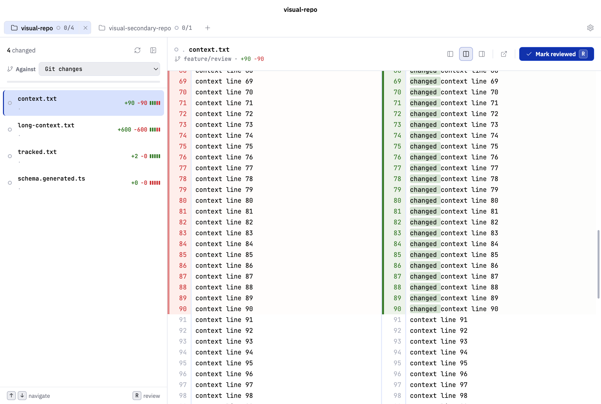
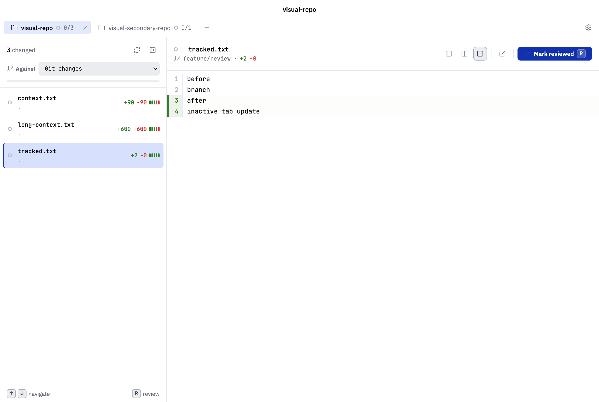

<p align="center">
  
</p>

# Difftray

Difftray is a local-first macOS desktop app for reviewing Git changes across multiple projects. It tracks which files have been reviewed, automatically invalidates that review state when the relevant diff changes, and turns review comments into a ready-made prompt for your favorite agent or AI tool.

Keep track of what changed, what you already reviewed, and what needs another look.

Difftray is not an IDE, not an AI agent host, and not a pull request platform. It is a focused review desk for local Git changes.

## Why Difftray?

Why not just use a regular Git diff client?

I built this because I kept losing track of my own reviews. I'd skim a diff, an agent would iterate, I'd come back, and I had no idea which files were still the ones I'd looked at and which had moved underneath me.

A few things came out of that:

- **Reviewed files don't stay reviewed if they change.** Mark a file as reviewed; if the diff for that file changes later, Difftray drops it back to unreviewed so you know to look again. It doesn't tell you _what_ changed, just that something did, and your previous pass is no longer trustworthy.
- **It's built around the iteration loop.** Working tree changes, branch changes,
  or a single committed patch, same flow. You're not preparing a PR, you're
  checking what the agent (or you) just did.
- **Comments are meant to go back to the agent.** Leave line-level notes while reviewing, then copy them out as a prompt.

## Current Features

- Keep several local repositories open in one review desk.
- See which projects still need attention without switching context.
- Review working tree changes, branch changes against a local ref, or a single
  recent/pasted commit with the same focused workflow.
- Move through changed files quickly, with noisy generated files out of the way
  by default.
- Read diffs in the shape that fits the moment: side-by-side, unified, expanded context, or focused on one side.
- Mark files reviewed and Difftray will flag them if they change later.
- Leave line-level review notes and copy a ready-made prompt to paste back into your favorite agent or AI tool.
- Drive review from the keyboard, command palette, or dense file list controls.
- Open the selected file in the system default editor or an installed common
  editor preset.
- Configure app appearance, default diff mode, line wrapping, generated-file
  visibility, drift notifications, and editor launch behavior.
- Stay local by design: no fetching, pushing, staging, editing, or repository metadata writes.

## Screenshots

Review workflow with inline comments and a ready-made agent handoff prompt:



Reviewed-file drift notification after a diff changes:



Expandable unchanged context in split diff mode:



Focused new-side diff view:



## Install

Download the latest macOS build from the [Releases page](https://github.com/prof18/difftray/releases/latest):

- **Apple Silicon (M-series):** `Difftray-arm64.dmg`
- **Intel:** `Difftray-x64.dmg`

Open the `.dmg` and drag Difftray into your Applications folder.

## Development

Prerequisites:

- Node.js 22 or newer
- pnpm 10.11.0 or newer
- Git available on `PATH`
- macOS for the intended desktop runtime

Install dependencies:

```sh
pnpm install
```

Run the desktop app in development:

```sh
pnpm dev
```

Build the app:

```sh
pnpm build
```

Run the full local CI gate before committing:

```sh
./ci.sh
```

`pnpm check` delegates to the same script.

Useful focused checks:

```sh
pnpm format
pnpm lint
pnpm typecheck
pnpm test
pnpm test:visual
pnpm bench:performance
```

Run `pnpm bench:performance` before and after changes that can affect large
changesets, workspace loading, file selection, mark-reviewed flow, diff loading,
diff rendering, review-state resolution, or bundle size.

## License

Apache-2.0.
