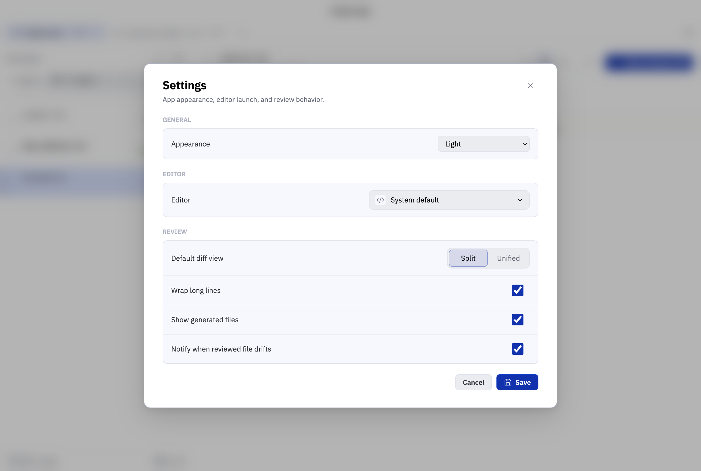

# Difftray

Difftray is a local-first macOS desktop app for reviewing Git changes across multiple projects. It tracks which files have been reviewed and automatically invalidates that review state when the relevant diff changes.

This repository is private while the product shape is being defined. The intended long-term direction is an open-source macOS app.

## Product Promise

Keep track of what changed, what you already reviewed, and what needs another look.

Difftray is not an IDE, not an AI agent host, and not a pull request platform. It is a focused review desk for local Git changes.

## Initial Stack

- Electron
- React
- TypeScript
- Vite
- pnpm workspaces
- custom React diff viewer backed by `@difftray/core` patch parsing
- SQLite for local app state
- Git CLI integration
- Chokidar for file watching
- CSS Modules with CSS custom properties
- Radix UI primitives where accessible behavior is useful
- lucide-react for icons
- Vitest for unit/integration tests
- Playwright for renderer and app workflow tests

## Screenshots




## Install And Run

Prerequisites:

- Node.js 22 or newer
- pnpm 10.11.0 or newer
- Git available on `PATH`
- macOS for the intended desktop runtime

Install dependencies:

```sh
pnpm install
```

Run the desktop app in development:

```sh
pnpm dev
```

Build the app:

```sh
pnpm build
```

Run the full local CI gate before committing:

```sh
./ci.sh
```

`pnpm check` delegates to the same script.

Useful focused checks:

```sh
pnpm format
pnpm lint
pnpm typecheck
pnpm test
pnpm test:visual
```

## Documentation

- [Product Brief](docs/product-brief.md)
- [V0 Specification](docs/spec-v0.md)
- [Architecture](docs/architecture.md)
- [Data Model](docs/data-model.md)
- [Testing Strategy](docs/testing-strategy.md)
- [Implementation Plan](docs/implementation-plan.md)
- [Roadmap](docs/roadmap.md)
- [Todo](docs/todo.md)
- [Naming Notes](docs/naming.md)
- [Contributing](CONTRIBUTING.md)
- [Decisions](docs/decisions)

## Core Principles

- Local-first by default.
- Review state is local only.
- Git repos and worktrees are first-class.
- File-level review is the v0 unit of completion.
- Exact diff changes invalidate reviewed state.
- The app should be keyboard-friendly from the beginning.
- Development should follow hard TDD for core behavior.
- Keep the app private until the project is ready for an intentional open-source launch.

## License

Apache-2.0.

## Current Status

Implementation has started. Difftray can open local repositories, list changed files, preview diffs, mark files reviewed, persist review state, configure project settings, and run the local quality gate.
